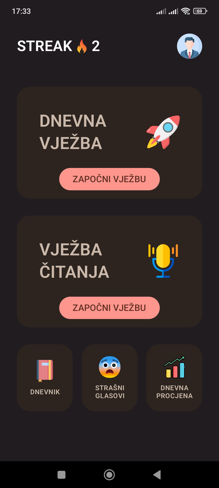
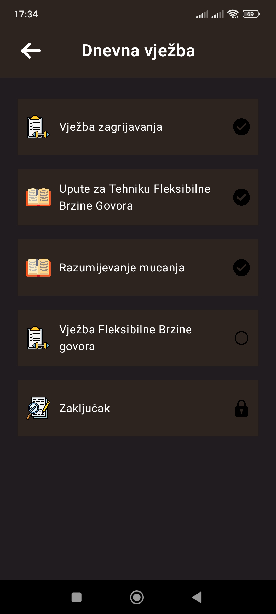
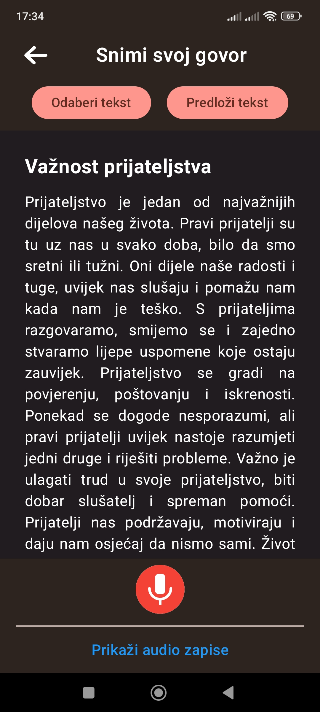
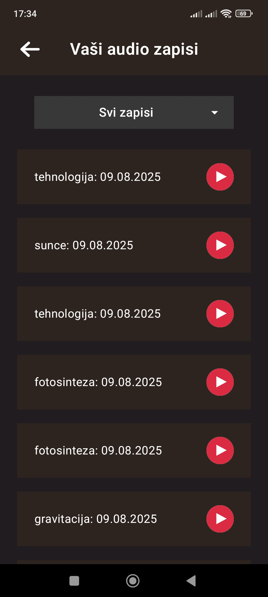
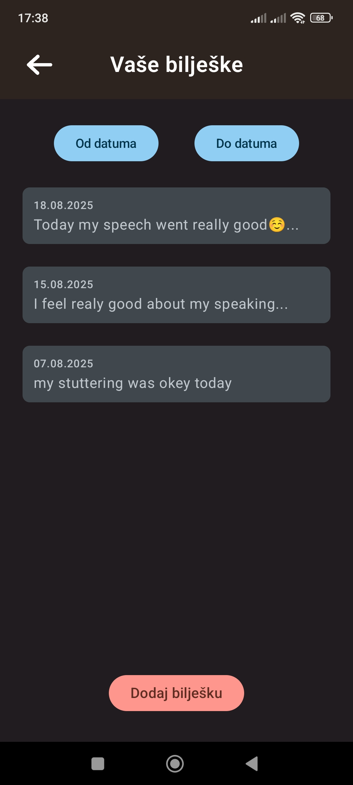
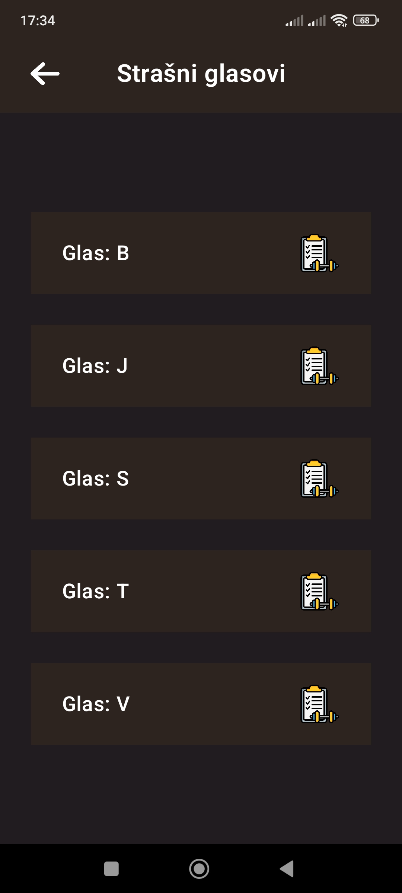
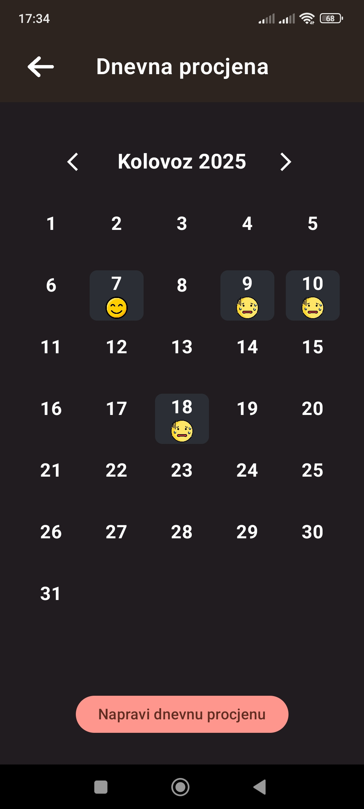

# 🗣️ Jasan-Govor – Android App

**Jasan-Govor** is an Android app designed to support **speech therapy for people who stutter**.  
It was developed as part of my **final thesis** at the *Faculty of Electrical Engineering, Computer Science and Information Technology Osijek*.

---

## 📸 Screenshots

  
  
  
  

  
  
  

---

## ✨ Features

- **🔐 User Authentication** – Secure register, login, and logout with Firebase
- **📅 Daily Exercises** – Structured, progressive day‑by‑day training plan
- **📖 Reading Exercise** – Practice with short texts while recording speech
- **📊 Assessment Module** – Daily self‑evaluation of stuttering
- **🔡 Feared Sounds Exercises** – Targeted exercises for specific sounds (e.g. “S”, “B”, “T”)
- **🎯 Therapy Techniques** – Practice Pull‑Outs, Preparatory Sets, Flexible Rate of Speech
- **📓 Journal & Notes** – Keep track of experiences, progress, and reflections
- **🔥 Streak Counter** – Motivates daily practice to build consistent habits
- **🎨 Modern UI** – 100% Jetpack Compose for smooth and accessible design
- **☁️ Firebase Sync** – Offline‑first, syncs data with Firestore when online

---

## 🛠️ Tech Stack

- **Kotlin** – Primary language
- **Jetpack Compose** – Declarative UI toolkit
- **Firebase Authentication** – User accounts and sessions
- **Firebase Firestore** – Cloud database
- **Navigation (Compose)** – Seamless in‑app navigation
- **Coil + Accompanist** – Efficient image loading and UI helpers
- **Coroutines + Flow/StateFlow** – Reactive and async programming